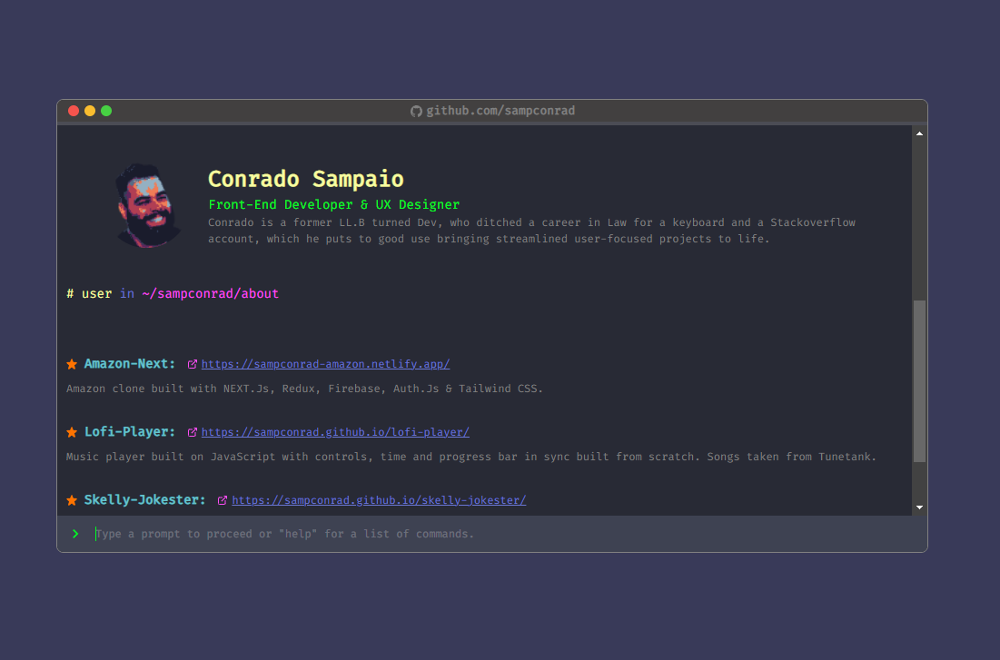

# interactive-terminal-portfolio

Demo: https://sampconrad-terminal.netlify.app/

## About
Interactive terminal-like portfolio website built on ReactJS with Vite and ChakraUI. Pulling information from the GitHub API to populate the displayed info.

## Using npm

Run commands

1. `npm install`

2. `npm run dev`

## Or using yarn

Run commands

1. `npm install --global yarn`

2. `yarn install`

3. `yarn run dev`
